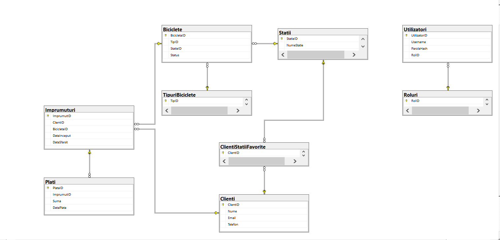

# Bike Rental Database System

A comprehensive SQL Server database project for managing a bicycle rental platform, featuring advanced database concepts including stored procedures, triggers, views, automated jobs, and role-based security.

## Overview

This project implements a complete database solution for a bike-sharing service, handling bike inventory, rental stations, customer rentals, payments, and user management. The system ensures data integrity through constraints, triggers, and transactional procedures.

## Features

- **8 relational tables** with 1-to-many and many-to-many relationships
- **CRUD stored procedures** for all major entities
- **Business logic procedures** with transaction handling (start/end rental)
- **DML triggers** for data consistency and automatic status updates
- **DDL trigger** for schema change auditing
- **Views** for reporting (availability, revenue, top customers)
- **Automated job** for status reconciliation
- **Role-based security** with granular permissions
- **Backup/restore strategy** with example scripts
- **Cursor implementation** for station availability reports

## Database Schema

### Tables

- **TipuriBiciclete** - Bicycle types catalog (city, mountain, electric)
- **Statii** - Rental stations with addresses
- **Biciclete** - Bike inventory with status tracking
- **Clienti** - Customer information
- **Imprumuturi** - Rental history (active and completed)
- **Plati** - Payment records
- **Roluri** - Application roles
- **Utilizatori** - User accounts with hashed passwords
- **ClientiStatiiFavorite** - Many-to-many relationship for favorite stations

### Key Relationships

- TipuriBiciclete → Biciclete (1-to-many)
- Statii → Biciclete (1-to-many)
- Clienti → Imprumuturi (1-to-many)
- Biciclete → Imprumuturi (1-to-many)
- Imprumuturi → Plati (1-to-many)
- Clienti ↔ Statii (many-to-many via ClientiStatiiFavorite)



## Technologies

- **DBMS**: Microsoft SQL Server
- **Language**: T-SQL (Transact-SQL)
- **Tools**: SQL Server Management Studio (SSMS)

## Installation & Setup

### Prerequisites

- SQL Server 2016 or later
- SQL Server Management Studio (SSMS)
- SQL Server Agent (for automated jobs)

### Setup Instructions

1. Clone this repository
2. Open SQL Server Management Studio
3. Create a new database named `bicicleta`
4. Execute the scripts in the following order:

```sql
-- 1. Create tables and indexes
USE bicicleta;
GO
-- Run: Tabele&Indecsi.sql

-- 2. Create views
-- Run: Views.sql

-- 3. Create stored procedures
-- Run: Proceduri.sql

-- 4. Create DML triggers
-- Run: TriggerDML.sql

-- 5. Create DDL trigger
-- Run: TriggerDDL.sql

-- 6. Create cursor procedure
-- Run: Cursor.sql

-- 7. Setup security (roles and permissions)
-- Run: Roluri&Drepturi.sql

-- 8. Create automated job
-- Run: Jobs.sql

-- 9. (Optional) Insert sample data and test queries
-- Run: queriesCuInsertSiViews.sql
```

## Key Components

### Stored Procedures

**Client Management:**
- `spClienti_Create` - Register new customer
- `spClienti_ReadById` - Get customer details
- `spClienti_Update` - Update customer information
- `spClienti_Delete` - Remove customer

**Bike Management:**
- `spBiciclete_Create` - Add new bike to inventory
- `spBiciclete_UpdateStatus` - Change bike status
- `spBiciclete_MoveToStatie` - Transfer bike to another station

**Rental Operations:**
- `spImprumut_Start` - Start rental (validates availability, locks bike)
- `spImprumut_End` - End rental (closes rental, updates bike status)

**Payment Processing:**
- `spPlati_Create` - Record payment for completed rental

### Triggers

**DML Triggers:**
- `tr_Imprumuturi_PreventDoubleActive` - Prevents multiple active rentals for same bike
- `tr_Imprumuturi_CloseSetsBikeAvailable` - Auto-updates bike status when rental closes
- `tr_Plati_DoarPentruImprumutInchis` - Ensures payments only for closed rentals

**DDL Trigger:**
- `tr_DDL_Audit_Bicicleta` - Logs schema changes (CREATE/ALTER/DROP)

### Views

- `vBicicleteDisponibilePeStatie` - Available bikes per station and type
- `vImprumuturiActive` - Currently active rentals
- `vVenituriLunare` - Monthly revenue report
- `vTopClienti` - Top 10 customers by rental count

### Automated Jobs

- `JOB_Biciclete_ReconcilereStatus` - Daily reconciliation job that fixes inconsistent bike statuses (runs at 02:00)

### Security Roles

- `db_admin_app` - Full database administration
- `db_operator` - Station operations (manage bikes, rentals)
- `db_cashier` - Payment processing and financial reports
- `db_readonly` - Read-only access for reporting

## Data Integrity

### Constraints

- **Primary Keys** on all tables (clustered indexes)
- **Foreign Keys** for referential integrity
- **UNIQUE** constraints on Email, Username, role names
- **CHECK** constraints:
  - Bike status must be 'disponibila', 'inchiriata', or 'mentenanta'
  - Payment amount must be positive
  - Rental end date must be after start date

### Indexes

- **Clustered**: Primary keys (automatic)
- **Nonclustered**:
  - `IX_Biciclete_StatieID` - Find bikes by station
  - `IX_Biciclete_Status` - Find bikes by status
  - `IX_Imprumuturi_ClientID` - Customer rental history
  - `IX_Plati_ImprumutID` - Payments per rental

## Example Usage

```sql
-- Start a rental
EXEC spImprumut_Start 
    @ClientID = 1, 
    @BicicletaID = 5;

-- End a rental and return to different station
EXEC spImprumut_End 
    @ImprumutID = 10, 
    @StatieReturnareID = 3;

-- Record payment
EXEC spPlati_Create 
    @ImprumutID = 10, 
    @Suma = 25.50;

-- Check available bikes at stations
SELECT * FROM vBicicleteDisponibilePeStatie;

-- View monthly revenue
SELECT * FROM vVenituriLunare 
ORDER BY An DESC, Luna DESC;
```

## Backup Strategy

- **Full backup**: Daily at 02:00
- **Differential backup**: Every 4-6 hours (optional)
- **Transaction log backup**: Hourly (if using FULL recovery model)

See `Backup&Restore.sql` for example scripts.

## Project Structure

```
.
├── Tabele&Indecsi.sql          # Table definitions and indexes
├── Views.sql                    # Reporting views
├── Proceduri.sql                # Stored procedures
├── TriggerDML.sql               # Data manipulation triggers
├── TriggerDDL.sql               # Schema change audit trigger
├── Cursor.sql                   # Cursor-based reporting
├── Jobs.sql                     # Automated maintenance job
├── Roluri&Drepturi.sql          # Security roles and permissions
├── Backup&Restore.sql           # Backup/restore scripts
├── queriesCuInsertSiViews.sql   # Sample data and queries
├── documentatie.html            # Full documentation (Romanian)
├── schema.png                   # Database diagram
└── README.md                    # This file
```

